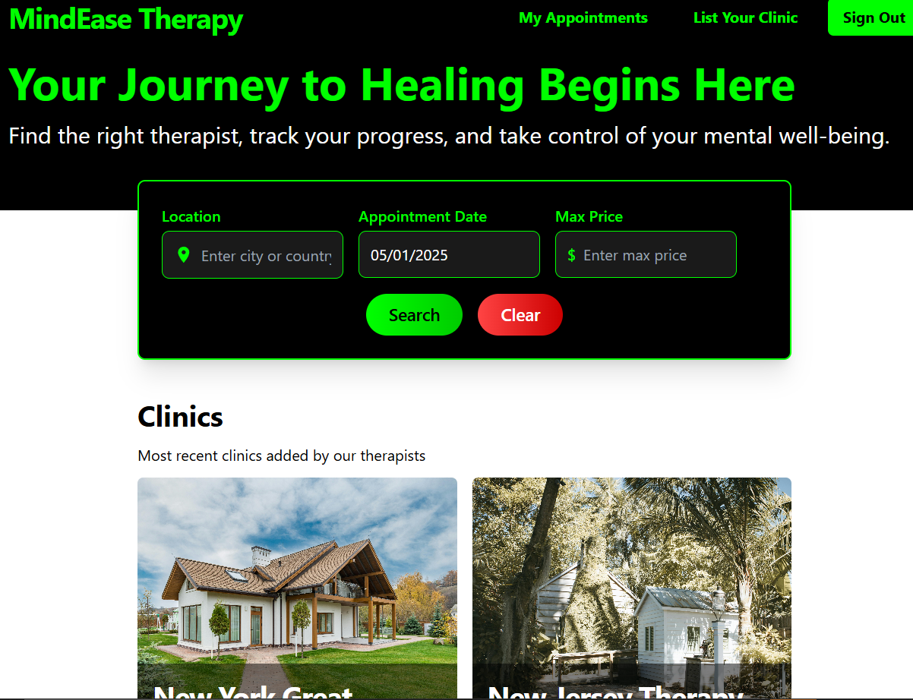
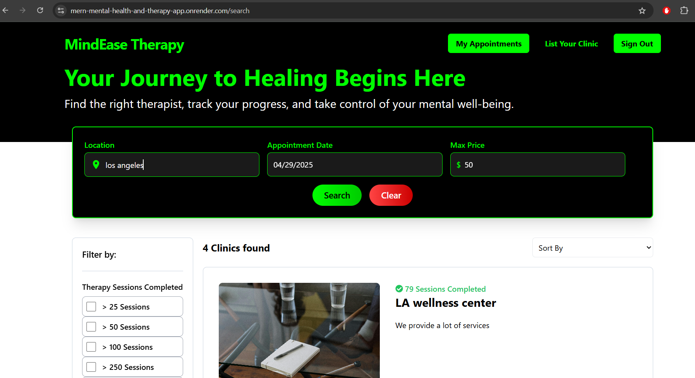
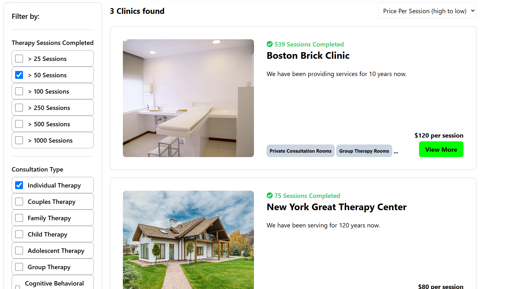
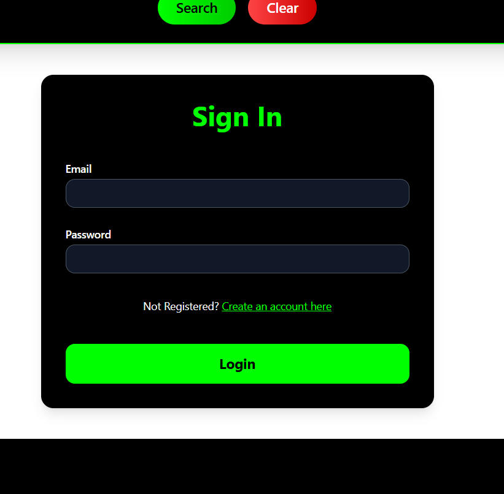
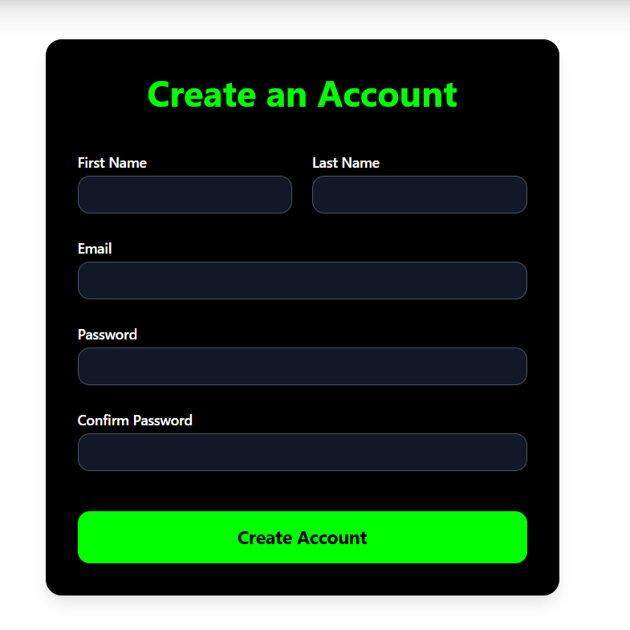
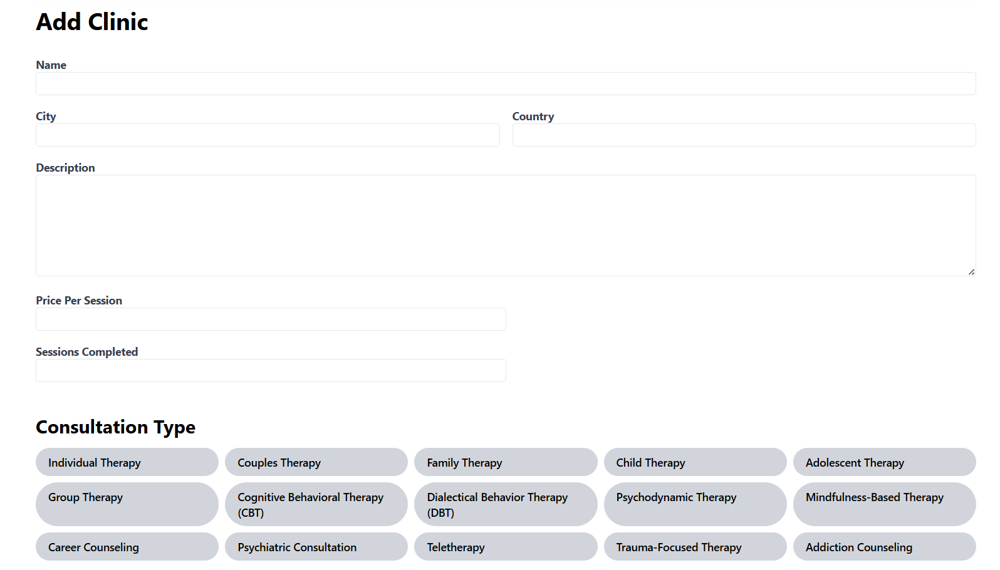
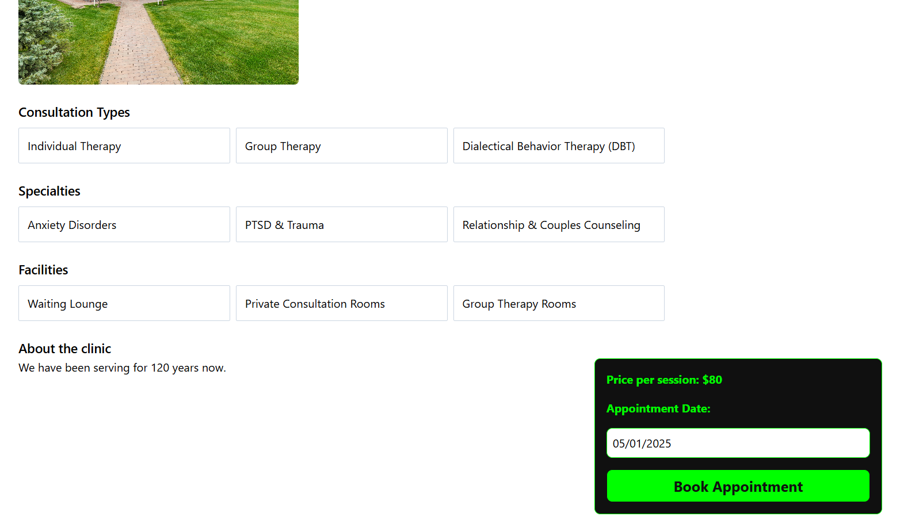
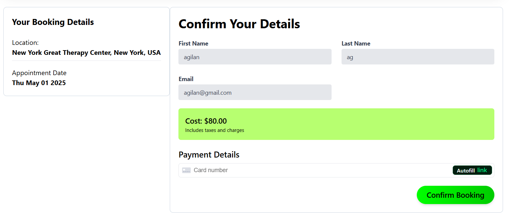

# Therapy Booking App 

MindEasy Therapy is a  full-stack web application for booking mental health therapy sessions. Built using the MERN stack, the app lets mental health therapists list their clinics and users can book different kinds of bookings such as individual and group therapy sessions, and comprises user authentication and real-time payments via Stripe.

## 📑 Table of Contents

- [Demo](#demo)
- [Features](#features)
- [Screenshots](#screenshots)
- [Tech Stack](#tech-stack)
- [Installation](#installation)
- [Contributing](#contributing)


## Demo

- Live App: [mern-mental-health-and-therapy-app.onrender.com](https://mern-mental-health-and-therapy-app.onrender.com/)

## Features

- Clinics can be listed by therapists across the globe
- Users can book various kinds of therapy such as individual therapy, couples therapy and family therapy
- Users can filter clinics based on location, availability date, consultation types and facilities at the clinic
- Users can sort clinics based on price(low to high/high to low) and the number of sessions completed by the clinic
- Stripe has been integrated into the app, enabling users to make payments while booking appointments with clinics

## Screenshots

The following screenshot displays the home page of the Therapy Booking App. Users can explore available services and begin their mental wellness journey.



The following screenshot displays the searchbar, using which users can filter clinics in terms of location, availability dates and maximum price.



The following screenshot displays the parameters using which the user can filter clinics based on the number of sessions completed by the clinic, consultation types offered by the clinic and the user can sort the clinics based on price and number of sessions completed.



The following screenshot displays the Sign In page of the app.



The following screenshot displays the Registration page of the app.



The following screenshot displays the form using which therapists can list their clinics.



The following screenshot displays the details page of the clinic that the user may want to book an appointment with.



The following screenshot displays the booking page where users can review their appointment details, contact information and make the payment.



The following screenshot displays the appointments that have been booked by the user with clinics.


## Tech Stack

- **Frontend:** React.js, React Router, TailwindCSS
- **Backend:** Node.js, Express.js
- **Database:** MongoDB, Mongoose
- **Authentication:** JWT, bcrypt
- **Payments:** Stripe API
- **Deployment:** Render

## Installation

1. Clone the repository:

```bash
git clone https://github.com/agilan11/mern-mental-health-and-therapy-app.git
```

2. Install dependencies for both frontend and backend:

```bash
cd frontend
npm install
cd ../backend
npm install
```

3. Create a .env file in /backend with the following:

MONGODB_CONNECTION_STRING = your_mongo_connection_string
JWT_SECRET_KEY = your_jwt_secret
FRONTEND_URL = http://localhost:<any_port>
CLOUDINARY_CLOUD_NAME = your_cloudinary_name
CLOUDINARY_API_KEY = your_cloudinary_api_key
CLOUDINARY_API_SECRET = your_cloudinary_
STRIPE_API_KEY = your_stripe_key

4. Create a .env file in /frontend with the following:

VITE_API_BASE_URL = http://localhost:<any_port>
VITE_STRIPE_PUB_KEY = your_stripe_public_key

5. Run the development servers:

```bash
# Backend
cd backend
npm run dev

# Frontend (in new terminal)
cd frontend
npm run dev
```

## Contributing

1. Fork this repo
2. Create a branch: `git checkout -b feature-name`
3. Make your changes and commit: `git commit -m 'Add new feature'`
4. Push to your fork: `git push origin feature-name`
5. Open a pull request


