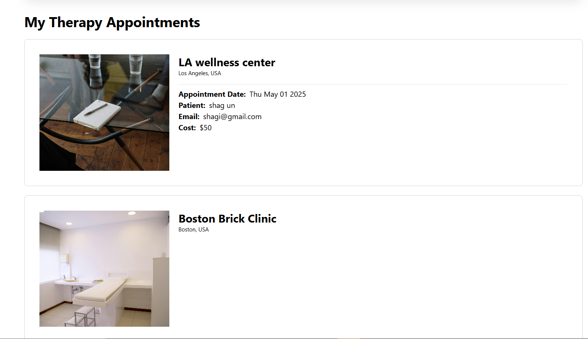

# Therapy Booking App 

MindEasy Therapy is a  full-stack web application for booking mental health therapy sessions. Built using the MERN stack, the app lets mental health therapists list their clinics and users can book different kinds of bookings such as individual and group therapy sessions, and comprises user authentication and real-time payments via Stripe.

## 📑 Table of Contents

- [Demo](#demo)
- [Features](#features)
- [Screenshots](#screenshots)
- [Tech Stack](#tech-stack)
- [Installation](#installation)
- [Usage](#usage)
- [API Endpoints](#api-endpoints)
- [Contributing](#contributing)
- [License](#license)

## 🔗 Demo

- Live App: [mern-mental-health-and-therapy-app.onrender.com](https://mern-mental-health-and-therapy-app.onrender.com/)

## ✨ Features

- List your clinic 
- Book various kinds of therapy such as individual or group therapy sessions
- Calendar scheduling 
- Stripe payments integration
- JWT-based authentication 

## 🖼️ Screenshots

